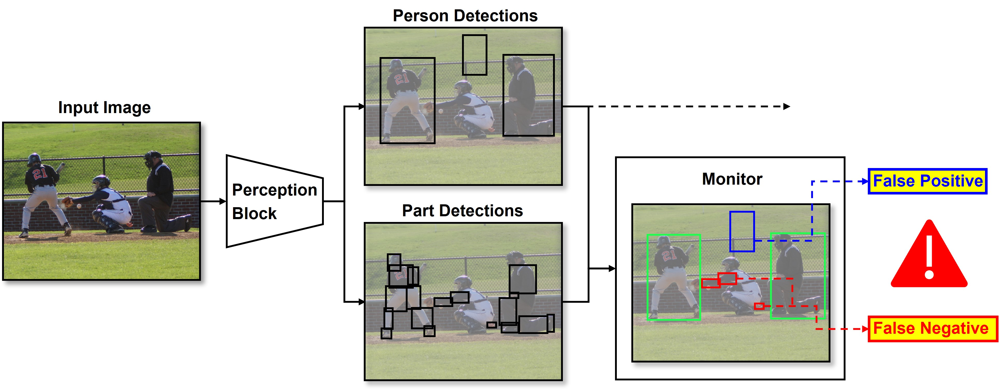

# Preventing Errors in Person Detection: A Part-Based Self-Monitoring Framework

This repository contains the code for re-producing the experiments of the paper "Preventing Errors in Person Detection: A Part-Based Self-Monitoring Framework" to be presented at [IEEE IV 2023](https://2023.ieee-iv.org/). 

Training and testing has been done with [mmdetection](https://github.com/open-mmlab/mmdetection). All models (both person detectors and body-part detectors) have been trained on a reduced training set of COCO2014 where [DensePose](http://densepose.org/) annotations (body-parts) for all visible persons are available. For evaluation, the COCO2014 validation split and the PascalVOC2010 trainval split has been used.



## Abstract

The ability to detect learned objects regardless of
their appearance is crucial for autonomous systems in real-world applications. Especially for detecting humans, which is
often a fundamental task in safety-critical applications, it is vital to prevent errors. To address this challenge, we propose a self-monitoring framework that allows for the perception system to perform plausibility checks at runtime. We show that by incorporating an additional component for detecting human
body parts, we are able to significantly reduce the number of
missed human detections by factors of up to 9 when compared
to a baseline setup, which was trained only on holistic person
objects. Additionally, we found that training a model jointly on
humans and their body parts leads to a substantial reduction
in false positive detections by up to 50% compared to training
on humans alone. We performed comprehensive experiments
on the publicly available datasets DensePose and Pascal VOC
in order to demonstrate the effectiveness of our framework.

# Installation

The code has been tested with Python 3.8, PyTorch 1.9.0, and CUDA 11.1.

## Prepare Submodule

```
$ git submodule init
$ git submodule update
```

## Create and activate virtual environment

```
$ python3 -m venv venv
$ source venv/bin/activate
```

## Install dependencies

```
$ ./install.sh
```

## Add the project path to environment variables

Open ~/.bashrc, and add the following line to the end.

```
$ export PYTHONPATH=<path_of_project>:$PYTHONPATH
```

# Workflow

## Download Datasets

Download [COCO2014](https://cocodataset.org/#download), [DensePose](http://densepose.org/), and [PascalVOC2010](http://host.robots.ox.ac.uk/pascal/VOC/voc2010/).

## Create Annotations

1. Convert VOC Annotations to COCO Annotations

Copy ```voc2coco.py``` from [here](https://github.com/roboflow/voc2coco) into your working directory and run

```
$ python3 voc2coco.py --ann_dir <path-to-voc>/Annotations --ann_ids <path-to-voc>/ImageSets/Main/trainval.txt --labels <path-to-voc>/labels.txt --output <path-to-anns-dir>/voc2010_trainval_cocoformat.json --ext xml
```

2. Prepare Annotations for training and evaluating

Generates annotations for person detector (only 1 class: person), body-parts detector (8 classes) and joint person-body-parts detector (9 classes). 
Replace dataset annotation paths in the script with your own.

```
$ ./scripts/create_annotations.sh
```

## Training

You can train the models with [mmdetection](https://github.com/open-mmlab/mmdetection). 
Replace the paths in the "TO MODIFY"-section of the config file with your own and run:

```
$ python mmdetection/tools/train.py <path-to-config-python-file>
```

## Store detections for further evaluations and experiments

Replace paths with your own and run:

```
$ ./scripts/store_detections.sh
```

## Run Analysis to calculate confidence thresholds

By running the following script, the confidence thresholds that have best precision-recall trade-off are computed and visualized. These thresholds are then later needed to perform the runtime monitoring experiments.

```
$ ./scripts/run_analysis.sh
```

## Run Experiments

By running the following script, you can reproduce the per-image and per-object experiment, where the final results are visualized in a table formatted in latex. 

```
$ ./scripts/run_experiments.sh
```

# Purpose of this project

This software was solely developed for and published as part of the publication cited above. It will neither be maintained nor monitored in any way.

# Citation

If you find our work useful in your research, please consider citing:

```
@inproceedings{schwaiger2023smf,
    title={Preventing Errors in Person Detection: A Part-Based Self-Monitoring Framework},
    author={Schwaiger, Franziska and Matic, Andrea and Roscher, Karsten and Günnemann, Stephan},
    journal={IEEEIV},
    year={2023}
}
```
